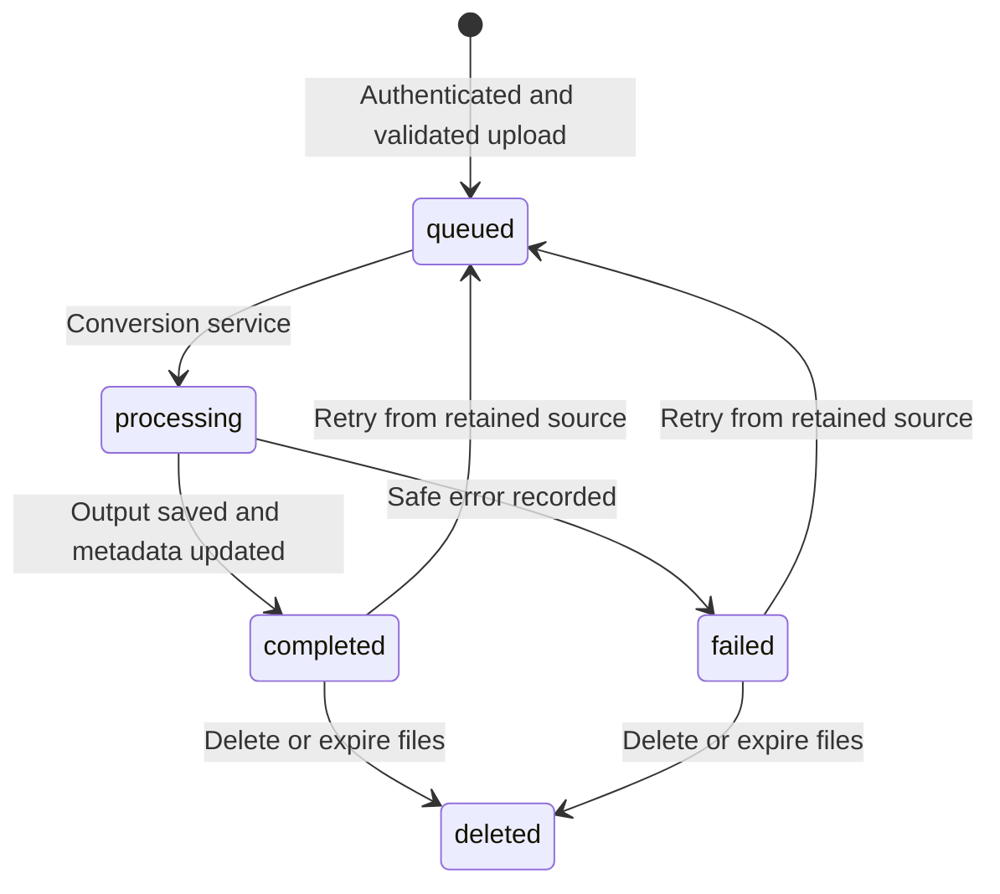

# FileMorph Architecture

## Boundaries

| Layer | Files | Responsibility |
| --- | --- | --- |
| App | `frontend/src/App.jsx` | Session bootstrap, public/protected navigation |
| Client | `frontend/src/api.js` | Credentialed requests, CSRF, single-flight refresh |
| Pages | `frontend/src/components/*Page.jsx`, `Workspace.jsx` | Auth, history, details, settings, privacy, conversion |
| API | `backend/api/` | Authentication, account-owned operations, HTTP contracts |
| Security | `backend/security/` | bcrypt, JWTs, CSRF, dependencies, per-process limits |
| Repository | `backend/database.py` | MongoDB or isolated in-memory development data |
| Jobs | `backend/services/conversion_service.py` | Status/progress, converter execution, output persistence |
| Storage | `backend/services/storage_service.py` | Unpredictable private keys, local/S3 adapters |
| Registry | `backend/converters/base.py`, `registry.py`, `builtins.py` | Typed format definitions and converter dispatch |
| Processing | Existing converter modules and `additional.py` | Deterministic conversion; no AI-generated results |
| Validation | `backend/utils/file_validator.py` | Type, MIME, signature, ZIP, page, dimensions, size |
| Retention | `backend/cleanup.py`, API lifespan | Expired-file cleanup entry point |

## Job Flow

Validation currently happens before creating a persisted job, so rejected uploads do not fabricate queued/validating history records. `validating` is reserved for a future asynchronous ingestion boundary. Small jobs run synchronously in separate child processes with hard timeouts; progress records are snapshots of actual stages, not simulated percentages.

Sources and outputs are stored separately. Batch jobs record ordered source keys. Markdown output is a ZIP containing the Markdown and its image assets; its preview is read from the stored archive through an authenticated route. No storage key or provider URL appears in a public job response.

## Ownership and Deletion

Every job lookup/update/history query includes the authenticated `user_id`. Cross-account IDs produce `404`. Deletion removes source/output objects and marks the job deleted; deleted tombstones are excluded from history and downloads. Account deletion removes account metadata, sessions, jobs, and files.

## Worker Evolution

API routes call the conversion-service boundary, not converter-specific logic. `create_and_run_job` can later enqueue an ID and a durable Redis-backed worker can call `conversion_executor.py`. Execution already uses process isolation, a hard timeout, output limits, and bounded concurrency. Before large serverless jobs, add OS/container memory limits, durable queue delivery, lease/claim logic, and worker-safe retention locking. PyMuPDF is never executed concurrently in converter threads.

## Phase Record

1. Registry: added `base.py`, `registry.py`, `builtins.py`; updated routing, validation, format tests. Original conversions remained green.
2. Identity: added config/repository/security/schema/auth modules and auth tests; cookie sessions and CSRF passed.
3. History: added conversion/user APIs, job service, account pages, history/details flows and ownership tests.
4. Storage: local/S3 interface, retention entry point, expiration and cleanup tests. Live provider credentials were not configured.
5. Matrix: added `additional.py`, 16 more registry modes, batch/range ingestion, real-file tests, and matching frontend cards.
6. Quality: 51 backend tests, 11 React tests, production build, representative browser/mobile checks, error/security hardening, documentation. Live provider and full accessibility/security review gates remain pending; no production-ready sign-off is claimed.
