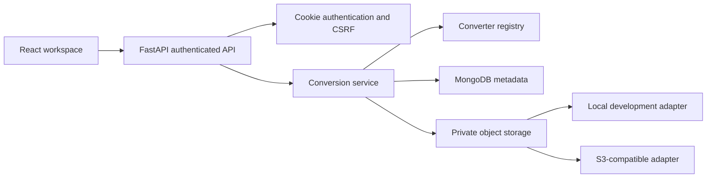

# FileMorph

FileMorph is a direct document-conversion website built with React/Vite and FastAPI. It retains the cream, forest-green, lime, typography, conversion cards, and upload-zone design.

Users choose a conversion, upload a file, and download the result directly. No login, database, or account is required.

## Architecture



See [PROJECT_ARCHITECTURE.md](PROJECT_ARCHITECTURE.md), [API_DOCUMENTATION.md](API_DOCUMENTATION.md), [SECURITY.md](SECURITY.md), and [DEPLOYMENT.md](DEPLOYMENT.md).

## Local Development

Requirements: Python 3.12+, Node.js 20.19+ or 22.12+, and optionally MongoDB.

```powershell
python -m venv .venv
.venv\Scripts\Activate.ps1
pip install -r backend/requirements.txt
pip install pytest httpx
Copy-Item .env.example .env
# Edit .env with local configuration. Never commit it.
cd frontend
npm install
npm run dev
```

The frontend is served at `http://localhost:5173` and FastAPI at `http://127.0.0.1:8001`. Vite proxies `/api` to FastAPI.

The root `.env` is loaded automatically. Without `MONGODB_URI`, metadata is held in memory for local development and is lost on restart. Files use `.filemorph-storage` by default. Empty development JWT secrets produce ephemeral random keys; configure environment secrets for stable sessions. Neither fallback is a production persistence guarantee.

## MongoDB

Set `MONGODB_URI` and `MONGODB_DATABASE=filemorph` in the environment. MongoDB stores users, conversion metadata, and hashed refresh sessions, not document bytes.

Indexes are created for unique normalized email, account/job date, status, unique refresh token hashes, and expired-refresh-session TTL. Job metadata does not use a TTL deletion index because cleanup needs storage keys to remove files first.

## Storage and Retention

`STORAGE_PROVIDER=local` uses private local files with random keys. `STORAGE_PROVIDER=s3` uses a private S3-compatible bucket and the standard environment credential chain:

```dotenv
STORAGE_PROVIDER=s3
S3_BUCKET=your-private-bucket
S3_ENDPOINT_URL=
AWS_ACCESS_KEY_ID=
AWS_SECRET_ACCESS_KEY=
AWS_DEFAULT_REGION=us-east-1
```

Use an unversioned bucket, or independently configure deletion of all object versions. Current-object deletion alone cannot permanently remove historical versions in a versioned bucket. The Vercel Blob adapter is not implemented; the example Blob token is a placeholder only.

Files expire after `FILE_RETENTION_HOURS` (24 by default). Long-lived API processes clean expired files every minute; expired download/detail/history requests also remove files. Production must schedule `python -m backend.cleanup` and configure matching storage lifecycle policies because serverless background loops are not durable.

## Environment

`.env.example` contains placeholders only. Important values include MongoDB settings, separate access/refresh JWT secrets, token lifetimes, explicit CORS origins, upload/page/retention limits, storage provider, and conversion timeout. Production requires `ENVIRONMENT=production`, MongoDB, S3 storage, and token secrets of at least 32 characters.

## Authentication

Passwords use bcrypt, never plaintext. Emails are trimmed and normalized. Short-lived access JWTs and rotating refresh JWTs are HTTP-only cookies, `SameSite=Lax`, and `Secure` in production. A separate CSRF cookie must match `X-CSRF-Token` for authenticated mutations. Tokens are not stored in localStorage.

Refresh-token hashes are stored server-side and consumed once during rotation. Logout revokes the refresh session. Password changes revoke refresh sessions and invalidate prior access tokens through an account version. Login errors do not distinguish unknown accounts from incorrect passwords.

## Supported Matrix and Fidelity

Only implemented converters appear in `/api/formats` and the UI.

| Conversion | Output and limitations |
| --- | --- |
| PDF to DOCX | High-resolution page images in Word; not editable/reflowable text |
| DOCX to PDF | Common structure, formatting, tables, links, images; advanced Word layout may differ |
| PDF to Markdown | Extracted structure and images in ZIP; no OCR or fixed page geometry |
| DOCX to Markdown | Common headings, lists, emphasis, tables, links, images in ZIP |
| Markdown to PDF | Safe rendered common Markdown; external assets and scripts removed |
| Markdown to DOCX | Headings, paragraphs, lists, basic tables; inline styling and images simplified |
| Markdown to HTML | Sanitized HTML; external images/scripts removed |
| DOCX to HTML | Text, headings, basic tables; advanced styling/images currently omitted |
| DOCX to TXT | Readable text and tab-separated tables; no images or styling |
| HTML to PDF | Sanitized content; CSS/scripts/external assets removed |
| HTML to DOCX | Basic headings, paragraphs, lists, tables; complex layout/inline styling omitted |
| TXT to PDF | UTF-8 text rendered to PDF |
| TXT to DOCX | UTF-8 paragraphs; no inferred rich formatting |
| JPG/PNG/WebP to PDF | Raster image as fixed-layout PDF page; transparency flattened |
| Multiple images to PDF | Pages combined in upload order, at most 20 files |
| PDF pages to PNG | 144-DPI page images in ZIP |
| PDF pages to JPG | 144-DPI page images in ZIP; lossy image compression |
| Merge PDF | Copies pages in upload order; combined page/file limits apply |
| Split PDF | Selected page ranges copied into a PDF |
| Compress PDF | Structural/stream optimization; size reduction is not guaranteed |

PDF is fixed-layout; DOCX, HTML, and Markdown reflow. No converter promises pixel-perfect, fully editable output. Password-protected PDFs, OCR, macros, scripts, embedded executables, and legacy `.doc` files are unsupported.

## API

Authentication: `/api/auth/signup`, `/login`, `/logout`, `/refresh`, `/me`.

Workspace: `/api/formats`, `/api/conversions`, `/api/conversions/{id}` with download, preview, retry, rename, and deletion operations.

History: `/api/history` and `/api/history/{id}`. Account: `/api/users/me` and `/api/users/me/password`. System: `/api/health` and `/api/ready`.

The original public `/api/convert` and `/api/convert/{conversion_type}` routes remain for compatibility. They do not create account history; restrict them at the gateway if anonymous conversion is not desired.

## Testing

```powershell
pytest
cd frontend
npm test
npm run build
```

Tests generate actual PDF, DOCX, image, Markdown, HTML, and TXT samples. They cover registered converters, authentication, rotation, CSRF, user isolation, history, download authorization, deletion, expiration, signatures, ZIP inspection, page/dimension limits, and key React flows.

Local verification: 51 backend tests, 11 React interaction tests, and the production build pass. Representative browser signup, conversion, history, details, rename, and 320px/390px mobile checks were performed without page errors. Live MongoDB/S3 integration and a full accessibility/security review remain required before production sign-off. Synchronous conversions use separate child processes with hard timeouts, output-size limits, and two concurrent execution slots per API process. Large jobs and multi-instance workloads still need durable queued workers, container memory limits, and distributed rate limiting. Vercel request execution is rejected until a process-capable worker is integrated.

## Deployment Status

This upgrade is local source work only. No push, deployment, production secrets, domains, databases, or storage infrastructure were modified. Existing Vercel configuration is preserved, but must not be treated as sufficient for the new authenticated platform without the prerequisites in `DEPLOYMENT.md`.
