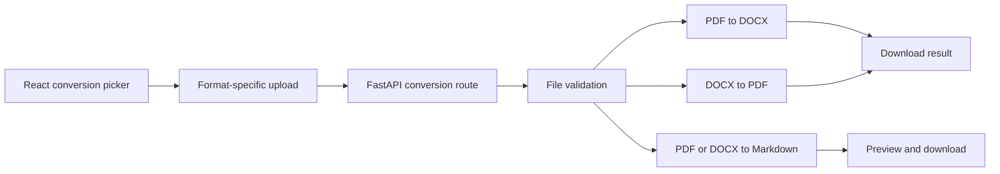

# FileMorph

FileMorph is a full-stack document converter for:

- PDF to layout-preserved DOCX
- DOCX to PDF
- PDF or DOCX to Markdown, including extracted images

Files are validated, processed in memory, returned to the browser, and are not permanently stored.

## Technology

- Frontend: React 19 and Vite
- Backend: Python 3.12 and FastAPI
- Document processing: PyMuPDF and python-docx
- Deployment: Docker, Render, and Vercel service configuration

## How it works



## Local development

Requirements: Python 3.11+ and Node.js 20+.

```bash
python -m venv .venv
# Windows: .venv\Scripts\activate
pip install -r backend/requirements.txt
cd frontend
npm install
npm run dev
```

Open `http://localhost:5173`. The command starts FastAPI on port 8001 and Vite on port 5173. Port 8001 is intentionally used for local development to avoid collisions with older services commonly left on port 8000.

## Tests

```bash
pip install pytest httpx
pytest
```

The test suite creates real PDF and DOCX files in memory and verifies all three conversion modes, validation failures, image extraction, Markdown bundles, and health reporting.

## API

### `GET /api/health`

```json
{"status":"healthy","service":"FileMorph"}
```

### `POST /api/convert/pdf-to-docx`

Accepts one multipart `file` field containing a PDF and returns a downloadable DOCX response.

### `POST /api/convert/docx-to-pdf`

Accepts one multipart `file` field containing a DOCX and returns a downloadable PDF response.

### `POST /api/convert/to-markdown`

Accepts a PDF or DOCX. It returns JSON containing Markdown, metadata, base64 image assets, and a ZIP bundle.

The original `POST /api/convert` Markdown endpoint remains available for backward compatibility.

## Project structure

```text
backend/
  converters/
    pdf_to_docx_converter.py   PDF to layout-preserved DOCX
    docx_to_pdf_converter.py   DOCX to PDF
    pdf_converter.py           PDF to Markdown
    docx_converter.py          DOCX to Markdown
    markdown_converter.py      Markdown helpers
  utils/file_validator.py      upload safety and type checks
  main.py                      FastAPI routes
frontend/
  src/App.jsx                  mode selection and conversion workflow
  src/components/              upload, status, preview, and SVG icons
tests/test_conversion.py       API and converter tests
```

## Conversion fidelity

For PDF to DOCX, FileMorph places a high-resolution rendering of each PDF page on the corresponding Word page. This preserves the visible layout, fonts, icons, rules, columns, and images and also supports scanned PDFs. The resulting Word pages are visually faithful, but their page contents are images rather than reflowable Word text. DOCX to PDF and Markdown conversion preserve the source structure where the format exposes it. Legacy binary `.doc` files are not supported; save them as `.docx` first.

## Docker

```bash
docker build -t filemorph .
docker run --rm -p 8080:8080 filemorph
```

Open `http://localhost:8080`.

## Deployment

The root `vercel.json` defines the frontend and backend services. `render.yaml` and the `Dockerfile` provide an alternative container deployment path for the combined application.
