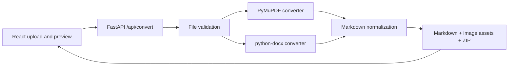

# MarkDrop

**Turn PDF and DOCX documents into clean, portable Markdown.**

MarkDrop is a lightweight full-stack converter that preserves useful document structure—headings, paragraphs, emphasis, lists, links, tables, and embedded images—without authentication, a database, or permanent file storage.

## Features

- Drag-and-drop PDF and DOCX upload with a 20 MB limit
- Structure-aware PDF conversion using font size and weight heuristics
- DOCX headings, bold/italic runs, lists, hyperlinks, and tables
- Image extraction from PDF and DOCX files
- Raw and rendered Markdown previews
- Standalone `.md` download and a ZIP bundle containing Markdown plus images
- In-memory request processing with no uploaded document written to disk
- Responsive, keyboard-accessible interface
- Docker, Google Cloud Run, and Render support

> No converter can guarantee pixel-perfect or byte-for-byte preservation when translating rich page-layout formats into Markdown. MarkDrop preserves the readable text and meaningful structure without paraphrasing it.

## Architecture



## Technology

- Frontend: React 19, Vite, React Markdown, CSS
- Backend: Python 3.12, FastAPI, PyMuPDF, python-docx
- Runtime: Uvicorn and a multi-stage Docker build

## Local development

Requirements: Python 3.11+, Node.js 20+.

### Recommended development command

```bash
python -m venv .venv
# Windows: .venv\Scripts\activate
pip install -r backend/requirements.txt
cd frontend
npm install
npm run dev
```

Open `http://localhost:5173`. This command starts both FastAPI on port 8000 and Vite on port 5173, so the API proxy is always available.

To run the services separately, use `npm run dev:api` and `npm run dev:web` in two terminals from the `frontend` directory.

## Tests

Install the test dependencies, then run:

```bash
pip install pytest httpx
pytest
```

The suite creates real PDF and DOCX fixtures in memory and covers successful conversions, image extraction, unsupported/corrupt/empty/oversized files, Markdown normalization, and the health endpoint.

## API

### `GET /api/health`

Returns service health:

```json
{"status":"healthy","service":"MarkDrop"}
```

### `POST /api/convert`

Accepts one multipart field named `file` containing a PDF or DOCX. The JSON response contains the Markdown, metadata, extracted image assets encoded as base64, and a ready-to-download ZIP bundle. Uploaded files are processed in memory and discarded when the request finishes.

Example:

```bash
curl -F "file=@document.pdf" http://localhost:8000/api/convert
```

## Docker

```bash
docker build -t markdrop .
docker run --rm -p 8080:8080 markdrop
```

Open `http://localhost:8080`.

## Deployment

### Google Cloud Run

```bash
gcloud builds submit --tag REGION-docker.pkg.dev/PROJECT/REPOSITORY/markdrop
gcloud run deploy markdrop --image REGION-docker.pkg.dev/PROJECT/REPOSITORY/markdrop --region REGION --allow-unauthenticated
```

Cloud Run supplies the `PORT` environment variable, which the container respects automatically. Set request limits and instance memory appropriate to the 20 MB upload ceiling.

### Render

Connect the repository in Render and choose **Blueprint**, or create a Docker web service manually. The included `render.yaml` configures the health check and port.

## Project structure

```text
backend/
  converters/       PDF, DOCX, and Markdown conversion
  utils/            validation and temporary file handling
  main.py            FastAPI routes and static frontend hosting
frontend/
  src/components/   upload, status, preview, and icons
  src/App.jsx        conversion workflow
tests/               API and converter tests
Dockerfile           production build
render.yaml          Render blueprint
```

## Limitations

- OCR is intentionally not included. Image-only scanned PDFs return a clear error.
- PDF reading order, complex columns, footnotes, and tables are best-effort because PDF stores positioned drawing instructions rather than semantic structure.
- Markdown cannot reproduce page layout, floating elements, fonts, or exact spacing.
- A standalone `.md` with image links must remain beside its `images/` directory; use the ZIP download for that complete bundle.
- Legacy binary `.doc` files are not supported; save them as `.docx` first.

## Future improvements

- OCR for scanned PDFs
- Advanced PDF table and multi-column detection
- Batch conversion and combined ZIP export
- PPTX and HTML input
- Optional client-side conversion history
